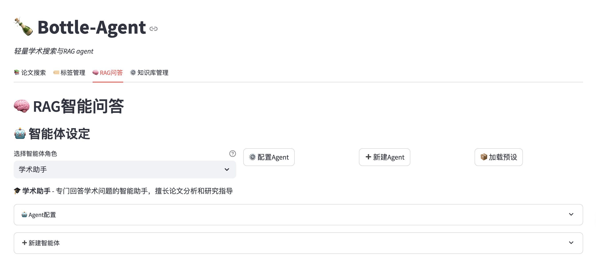

# 🍾 Bottle-Agent

一个功能丰富的智能Agent系统，集成学术论文搜索、RAG问答、Agent管理和工具扩展能力，为研究和学习提供全方位支持。


## ✨ 功能特性

### 📚 论文智能搜索
- 支持arXiv和Semantic Scholar API
- LLM驱动的查询优化
- 自然语言搜索支持
- 多源论文聚合展示
- 智能论文推荐和分类

### 🧠 本地RAG知识库
- 支持PDF、TXT、Markdown、DOCX文档
- 基于FAISS的向量检索
- 智能文档分块和嵌入
- 上下文感知的问答系统
- 多知识库并行管理
- 增量更新和自动去重

### 🤖 智能Agent管理
- **Agent配置系统**：支持自定义Agent角色和行为
- **预设Agent模板**：内置多种专业领域Agent
- **动态Agent切换**：在对话中灵活切换不同Agent
- **Agent参数调优**：精细化控制Agent响应特性
- **Agent导入导出**：便捷的Agent配置分享机制

### 🛠️ 工具与扩展系统
- **MCP服务器集成**：支持Model Context Protocol标准
- **工具接口配置**：灵活的外部工具集成能力
- **Puppeteer自动化**：内置网页自动化工具支持
- **可扩展架构**：支持自定义工具开发和集成
- **工具链管理**：组合多个工具实现复杂任务

### 🖥️ 多种交互方式
- **命令行界面（CLI）**：高效的命令行操作体验
- **Web界面（Streamlit）**：直观的图形化操作界面
- **Agent对话界面**：专门的Agent交互页面
- **知识库管理界面**：可视化的知识库操作面板
- **灵活的配置管理**：统一的配置文件管理系统

## 🚀 快速开始

### 1. 环境准备

```bash
# 克隆项目
git clone https://github.com/cyborvirtue/Bottle-agent.git
cd bottle_agent

# 创建conda虚拟环境
conda create -n bottle-agent python=3.8
conda activate bottle-agent

# 安装依赖
pip install -r requirements.txt

# 启动Web界面
streamlit run main.py -- --mode web

# 然后在浏览器中访问 http://localhost:8501
```

### 2. 配置设置

编辑 `config.yaml` 文件，设置必要的API密钥：

#### 使用OpenAI
```yaml
llm:
  provider: "openai"
  api_key: "your-openai-api-key"  # 或设置环境变量OPENAI_API_KEY

embedding:
  api_key: "your-openai-api-key"  # 同上
```

#### 使用火山引擎
```yaml
llm:
  provider: "volcengine"
  volcengine:
    api_key: "your-ark-api-key"  # 或设置环境变量ARK_API_KEY
    model: "deepseek-r1-250120"  # 火山引擎模型ID

embedding:
  api_key: "your-openai-api-key"  # 嵌入模型仍使用OpenAI
```

#### 其他配置
```yaml
paper_search:
  semantic_scholar:
    api_key: "your-semantic-scholar-api-key"  # 可选
```

### 3. 运行方式

#### 命令行模式

```bash
# 启动交互式CLI
python main.py --mode cli

# 直接搜索论文
python main.py --search "transformer architecture"

# RAG问答
python main.py --rag-query "什么是注意力机制？" --kb-name "ai_papers"

# 创建知识库
python main.py --create-kb "ai_papers" --folder "/path/to/papers" --description "AI相关论文"
```

#### Web界面模式

```bash
# 启动Web界面
streamlit run main.py -- --mode web

# 然后在浏览器中访问 http://localhost:8501
```

#### Agent功能使用

**在Web界面中**：
1. 访问RAG问答页面
2. 在Agent配置区域选择或创建Agent
3. 配置Agent参数和工具
4. 开始智能对话

**Agent管理功能**：
- 创建自定义Agent角色
- 导入预设Agent模板
- 配置Agent系统提示词
- 设置Agent工具和MCP服务器
- 调整Agent响应参数

## 📖 详细使用说明

### 论文搜索

支持自然语言查询，系统会自动优化搜索关键词：

```bash
# CLI示例
search> diffusion models in medical imaging

# 或在Web界面中输入查询
```

### 知识库管理

#### 创建知识库

```bash
# CLI命令
create_kb ai_papers /path/to/papers "AI相关论文集合"

# 支持的文件格式：PDF, TXT, Markdown, DOCX
```

#### 查询知识库

```bash
# CLI命令
query ai_papers "解释一下transformer的自注意力机制"

# 使用特定Agent查询
query ai_papers "解释一下transformer的自注意力机制" --agent "AI研究助手"
```

#### 管理知识库

```bash
# 列出所有知识库
list_kb

# 查看知识库信息
info_kb ai_papers

# 更新知识库
update_kb ai_papers

# 删除知识库
delete_kb ai_papers
```

### Agent管理

#### 创建和配置Agent

**通过Web界面**：
1. 点击"新建Agent"按钮
2. 设置Agent基本信息（名称、描述）
3. 配置系统提示词定义Agent角色
4. 选择可用工具和MCP服务器
5. 调整Agent参数（温度、最大token等）

**预设Agent使用**：
- 学术研究助手：专门用于论文分析和学术问答
- 代码分析师：专注于代码理解和编程问题
- 通用助手：适用于日常对话和通用任务

#### Agent工具配置

```yaml
# Agent配置示例
agent:
  name: "学术研究助手"
  description: "专门用于学术论文分析和研究问答"
  system_prompt: "你是一个专业的学术研究助手..."
  tools:
    - "文档分析"
    - "论文检索"
    - "数据可视化"
  mcp_servers:
    - "puppeteer"
    - "file_manager"
  parameters:
    temperature: 0.7
    max_tokens: 2048
```

## 🏗️ 项目结构

```
bottle_agent/
├── main.py                 # 主入口文件
├── config.yaml            # 配置文件
├── requirements.txt       # 依赖列表
├── README.md             # 项目说明
├── src/                  # 源代码目录
│   ├── __init__.py
│   ├── config/           # 配置管理
│   │   └── settings.py
│   ├── llm/              # LLM客户端
│   │   └── llm_client.py
│   ├── paper_search/     # 论文搜索
│   │   └── search_engine.py
│   ├── rag_system/       # RAG系统
│   │   ├── knowledge_base.py
│   │   ├── document_processor.py
│   │   ├── embedding_client.py
│   │   └── agent_manager.py    # Agent管理系统
│   └── ui/               # 用户界面
│       ├── cli_interface.py
│       └── web_interface.py    # 包含Agent管理界面
├── data/                 # 数据存储目录
│   ├── knowledge_bases/  # 知识库存储
│   │   └── agents/       # Agent配置存储
│   ├── cache/           # 缓存文件
│   └── vector_db/       # 向量数据库
├── examples/            # 示例和模板
│   └── agent_presets.json  # 预设Agent配置
└── logs/                # 日志文件
```

### 核心模块说明

- **agent_manager.py**：Agent生命周期管理，包括创建、配置、加载和删除
- **web_interface.py**：集成Agent管理界面，支持可视化Agent操作
- **agent_presets.json**：预定义的Agent模板，快速启动不同类型的Agent
- **agents/**：用户自定义Agent配置的存储目录

## ⚙️ 配置说明

### LLM配置

```yaml
llm:
  provider: "openai"        # LLM提供商: openai, volcengine
  model: "gpt-3.5-turbo"   # 模型名称
  api_key: ""              # API密钥
  max_tokens: 2048         # 最大token数
  temperature: 0.7         # 温度参数
  
  # 火山引擎配置（当provider为volcengine时使用）
  volcengine:
    base_url: "https://ark.cn-beijing.volces.com/api/v3"
    api_key: ""            # 火山引擎API密钥
    model: "deepseek-r1-250120"  # 火山引擎模型ID
    timeout: 1800          # 深度思考模型建议设置较长超时时间
```

### 嵌入模型配置

```yaml
embedding:
  provider: "openai"                              # openai 或 huggingface
  model: "text-embedding-ada-002"                # 模型名称
  # model: "sentence-transformers/all-MiniLM-L6-v2"  # HuggingFace示例
```

### RAG系统配置

```yaml
rag:
  document_processing:
    chunk_size: 1000        # 文档块大小
    chunk_overlap: 200      # 块重叠大小
  retrieval:
    top_k: 5               # 检索文档数量
    max_context_length: 4000  # 最大上下文长度
```

### Agent系统配置

```yaml
agent:
  default_agent: "通用助手"     # 默认Agent
  max_agents: 10             # 最大Agent数量
  agent_timeout: 300         # Agent响应超时时间
  
  # Agent默认参数
  default_params:
    temperature: 0.7
    max_tokens: 2048
    top_p: 1.0
    frequency_penalty: 0.0
    presence_penalty: 0.0

# MCP服务器配置
mcp:
  servers:
    puppeteer:
      command: "npx"
      args: ["@modelcontextprotocol/server-puppeteer"]
      env:
        PUPPETEER_HEADLESS: "true"
    
  # 工具配置
  tools:
    enabled: true
    max_tools_per_agent: 5
    tool_timeout: 60
```

## 🔧 高级功能

### Agent智能化特性

**多Agent协作**：
- 支持多个Agent同时工作
- Agent间任务分工和协调
- 专业领域Agent自动选择

**Agent学习能力**：
- 基于对话历史的Agent优化
- 个性化Agent行为调整
- Agent性能统计和分析

### 工具生态系统

**MCP标准支持**：
- 完整的Model Context Protocol实现
- 第三方MCP服务器无缝集成
- 标准化的工具接口规范

**内置工具集**：
- 网页自动化（Puppeteer）
- 文档处理和分析
- 数据检索和整理
- 可视化图表生成

### 自定义嵌入模型

支持使用HuggingFace的sentence-transformers模型：

```yaml
embedding:
  provider: "huggingface"
  model: "sentence-transformers/all-MiniLM-L6-v2"
```

### 批量文档处理

系统支持批量处理文件夹中的所有支持格式文档，自动去重和增量更新。

### 智能缓存机制

- 多层缓存策略提高响应速度
- Agent对话历史智能缓存
- 向量检索结果缓存优化
- 自动缓存清理和更新

## 🐛 故障排除

### 常见问题

1. **API密钥错误**
   - 确保在`config.yaml`中正确设置API密钥
   - 或设置环境变量`OPENAI_API_KEY`

2. **依赖安装失败**
   - 确保Python版本 >= 3.8
   - 使用虚拟环境避免依赖冲突

3. **文档处理失败**
   - 检查文件格式是否支持
   - 确保文件没有损坏
   - 检查文件路径是否正确

4. **Web界面无法启动**
   - 确保安装了Streamlit：`pip install streamlit`
   - 检查端口8501是否被占用

### 日志查看

日志文件位于`logs/`目录下，可以查看详细的错误信息。


### 🤝 参与贡献

如果你对以上任何功能感兴趣，欢迎：
- 🐛 提交Issue讨论具体实现方案
- 🔧 提交Pull Request实现相关功能
- 📝 完善文档和测试用例
- 💡 提出新的功能建议

## 🤝 贡献指南

欢迎提交Issue和Pull Request！

### 开发环境设置

```bash
# 安装开发依赖
pip install pytest black flake8

# 代码格式化
black src/

# 代码检查
flake8 src/

# 运行测试
pytest
```

## 📄 许可证

MIT License

## 🙏 致谢

- [arXiv API](https://arxiv.org/help/api) - 论文数据源
- [Semantic Scholar API](https://www.semanticscholar.org/product/api) - 论文数据源
- [FAISS](https://github.com/facebookresearch/faiss) - 向量检索
- [Streamlit](https://streamlit.io/) - Web界面框架
- [OpenAI](https://openai.com/) - LLM和嵌入服务